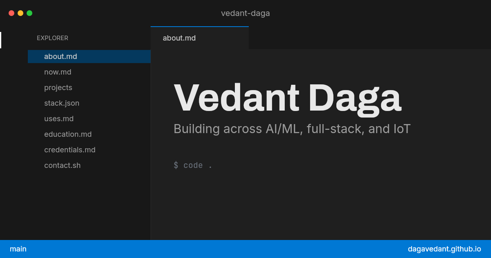

# dagavedant.github.io

my portfolio, built to look like the editor i actually work in.

**[dagavedant.github.io](https://dagavedant.github.io)**



## the idea

every portfolio i looked at was the same long scrolling page with cards. i spend
most of my time in vs code, so i built the site as vs code instead. everything is
a file. you open it from the explorer on the left, it opens in a tab, and you can
close it.

the project files are the interesting part. they are named after the language
each repo is actually written in, so the tree shows the range before you read a
word, and opening one gives you a github repo page.

## what's real

nothing about the projects is typed by hand. a script hits the github api during
the build and writes out the descriptions, languages, file lists, commits, star
counts and readmes. the site ships that, so nobody visiting makes an api call and
nothing goes stale between deploys.

it rebuilds every two days on its own, so what you are reading is current.

## running it

```
npm install
npm run dev
```

that uses the repo data already committed, so it works offline.

to pull fresh data you need a github token, since the full run makes about 400
requests and github only allows 60 an hour without one:

```
GITHUB_TOKEN=your_token npm run fetch:repos
```

there is a `--lite` version that skips the per-file source and fits in the
unauthenticated limit:

```
npm run fetch:repos:lite
```

## the pieces

| | |
|---|---|
| `src/components/ide` | the editor itself: title bar, explorer, tabs, panel, status bar |
| `src/components/docs` | how each file type gets rendered |
| `src/components/repo` | the github repo pages |
| `src/data/portfolio-data.js` | everything about me. the only file you would edit |
| `scripts/fetch-repos.mjs` | the build-time github fetch |
| `scripts/make-og.mjs` | draws the link preview image |

## built with

react, vite and tailwind. shiki for the syntax colours, done at build time so no
highlighter ships to the browser. the colours are vs code's dark modern, matched
exactly.

## if you want to use it

fork it, then edit `src/data/portfolio-data.js` and point the project list at
your own repos. the build reads your github from there and fills in the rest.
