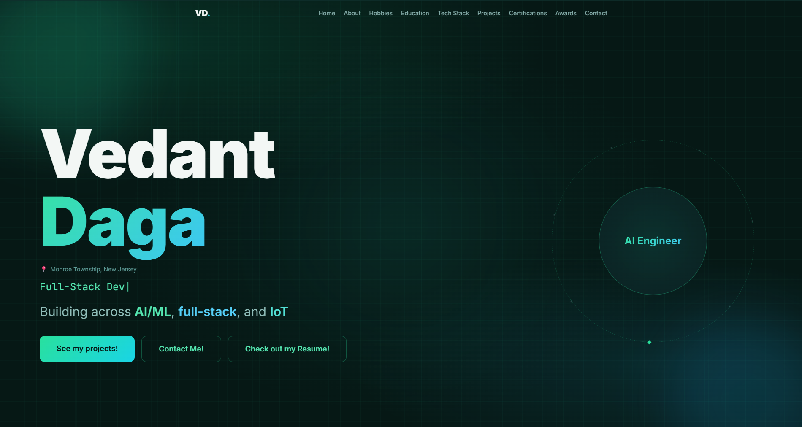

# My Portfolio

A personal portfolio site for me, an aspiring AI/ML engineer and full-stack developer, showing my projects across deep learning, full-stack web, and IoT.



**[View live site](https://dagavedant.github.io/My-Portfolio/)**

## Features
- Animated typewriter role cycle (AI Engineer -> ML Developer -> Full-Stack Dev -> IoT Tinkerer)
- Tons of customized project cards covering deep learning, NLP, hardware, and web — each with a GitHub link
- Tech stack with spaces to enter languages, ML frameworks, web tooling, and hardware you know
- Education, hobbies, and awards sections (almost like a brag sheet)
- Scroll-reveal animations using the Intersection Observer API
- Works on mobile and desktop
- Fully customizable for anyone, just fork the repositiory and fill your information at /src/data/portfolio-data.js 

## Currently in progress
- **[PulseFlow-AI](https://github.com/DagaVedant/PulseFlow-AI)** — healthcare ops platform combining optimization, simulation, forecasting, and AI to catch hospital bottlenecks
- **[GardenBuddy](https://github.com/DagaVedant/GardenBuddy)** — Raspberry Pi garden monitor running an LSTM classifier and a local Ollama LLM side by side
- **[Python-Examples](https://github.com/DagaVedant/Python-Examples)** — browser-based Python course for beginners, no downloads or paywalls

## Run locally

Requires **Node.js 20 or higher**.

```bash
npm install
npm run dev
```

Open [http://localhost:5173/My-Portfolio/](http://localhost:5173/My-Portfolio/).

To build and deploy to GitHub Pages:

```bash
npm run deploy
```

## How it works

All portfolio content lives in one file — [src/data/portfolio-data.js](src/data/portfolio-data.js). Changing a projet, updating the tech stack with your new skills, or editing your socials only needs you to edit that one page. I made it spefically because I'm still a high schooler, so im learning a lot of skills, and doing more projects, so its easier for me to edit and easier for others to fork a repository for themselves and make their own website.

Scroll-reveal animations use a shared `RevealSection` wrapper ([src/components/portfolio/RevealSection.jsx](src/components/portfolio/RevealSection.jsx)) backed by `IntersectionObserver` rather than a scroll event listener. Each element unobserves itself once visible, so there are zero ongoing listeners after the page loads.

## Challenges I faced

- **Project images getting cropped instead of shown in full.** Each project card had a fixed-height image box using `object-cover`, which fills the box by cropping whatever doesn't fit. On wide screenshots this cut off half the image. Switched to `object-contain` with an accent-colored background behind it, so the whole image always shows, letterboxed if it doesn't match the box's aspect ratio.
- **Linking project images straight from GitHub instead of hosting them.** Pulling screenshots from `raw.githubusercontent.com` means one repo path change silently breaks an image on this site, and the browser doesn't throw a normal 404 for it, it blocks the request as an opaque response, which is harder to debug. Had to check each URL with the GitHub API to confirm the file actually still existed at that path.
- **Making the site editable without touching layout code.** Since I'm still learning and adding projects constantly, I didn't want every update to mean digging through JSX. Pulling all content into `portfolio-data.js` means adding a project, cert, or award is just adding an object to an array.
- **Deploying a Vite app to a GitHub Pages subpath.** GitHub Pages serves this repo from `/My-Portfolio/`, not the domain root, so asset paths broke until I set `base: '/My-Portfolio/'` in `vite.config.js` and used `import.meta.env.BASE_URL` for local image references instead of hardcoding `/`.
- **Text contrast on a dark background.** Early on, body text used a muted, low-saturation teal that looked fine to me but read as low-contrast to others. Bumped the lightness across every section so text stays readable without losing the dark theme.

## Built with

- [React 18](https://react.dev) + [Vite](https://vitejs.dev)
- [Tailwind CSS](https://tailwindcss.com) + [shadcn/ui](https://ui.shadcn.com)
- [Framer Motion](https://www.framer.com/motion/)
- Deployed with [GitHub Pages](https://pages.github.com) with `gh-pages`
